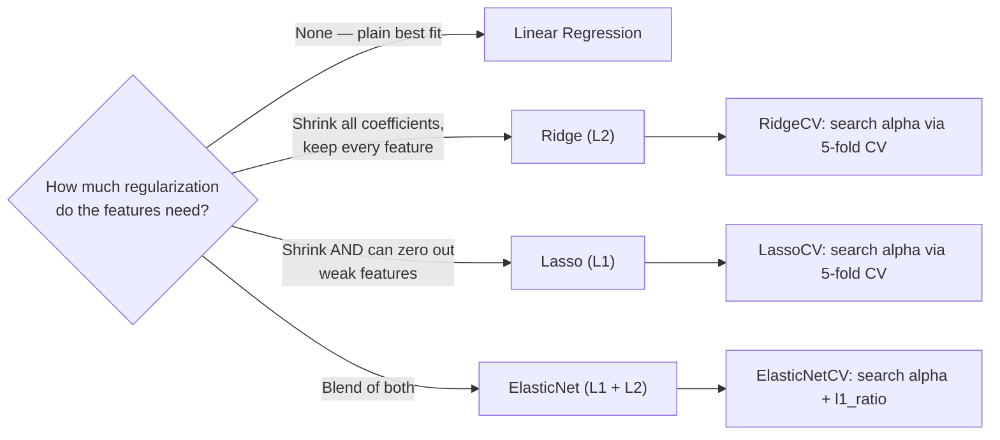

# 🔥 Algerian Forest Fires — FWI Regression Pipeline


> A step-by-step, teacher-style walkthrough of how this project turns raw Algerian weather-station readings into a tuned regression model that predicts the **Fire Weather Index (FWI)**. Written so that future-you (or anyone else) can open this file, follow the diagrams, and understand *why* each step exists — not just *what* it does.

---

## 📑 Table of Contents

1. [Project Overview](#1-project-overview)
2. [The Big Picture — End-to-End Pipeline](#2-the-big-picture--end-to-end-pipeline)
3. [Repository Structure](#3-repository-structure)
4. [Step-by-Step Walkthrough](#4-step-by-step-walkthrough)
5. [Model Comparison / Results](#5-model-comparison--results)
6. [Key ML Concepts Covered](#6-key-ml-concepts-covered)
7. [⚠️ Things Worth Reconsidering](#7-️-things-worth-reconsidering)
8. [Tech Stack](#8-tech-stack)
9. [How to Run](#9-how-to-run)
10. [🔧 To-Do / Revise Later](#10--to-do--revise-later)
11. [Author](#11-author)

---

## 1. Project Overview

**Dataset:** Algerian Forest Fires Dataset — 244 records from two regions of Algeria (Bejaia in the northeast, Sidi-Bel Abbes in the northwest), 122 records each, collected June–September 2012. Each record has 11 weather/fire-index attributes plus a `Classes` label (`fire` / `not fire`).

**Target variable:** `FWI` (Fire Weather Index) — a continuous score, so this is framed as a **regression problem**.

> 📌 Note: the dataset also ships with a ready-made binary `Classes` column, which would support a *classification* formulation ("will there be a fire, yes/no?"). This project doesn't do that — it predicts the numeric FWI score instead. That's a reasonable v2 extension (see [To-Do](#10--to-do--revise-later)).

**Two notebooks, two jobs:**

| Notebook | Role |
|---|---|
| `Ridge__Lasso_Regression.ipynb` | Loads the **raw** CSV, cleans it, explores it (EDA), and writes out a cleaned CSV |
| `Model_Training.ipynb` | Loads the **cleaned** CSV, engineers features, trains 4 regression models (+ 3 cross-validated variants), and evaluates them |

---

## 2. The Big Picture — End-to-End Pipeline

Read this top to bottom — it's the whole project in one diagram.


---

## 3. Repository Structure

> This is the suggested layout — rename paths below to match your actual folders, then delete this note.

```
Algerian-Forest-Fire-FWI-Prediction/
│
├── Data/
│   ├── Algerian_forest_fires_dataset_UPDATE.csv      # raw dataset (input)
│   └── Algerian_forest_fires_cleaned_dataset.csv     # cleaned dataset (generated)
│
├── Notebooks/
│   ├── 01_Data_Cleaning_and_EDA.ipynb                # currently: Ridge__Lasso_Regression.ipynb
│   └── 02_Model_Training.ipynb                       # currently: Model_Training.ipynb
│
├── requirements.txt
└── README.md
```

---

## 4. Step-by-Step Walkthrough

### Step 1 — Load & Understand the Raw Data
The raw CSV has a quirky header (the real column names start on row 2, hence `header=1` when reading it), and it silently contains **two datasets stacked together** — the first 122 rows are the Bejaia region, the rest are Sidi-Bel Abbes, separated by a blank row.

```python
dataset = pd.read_csv('Algerian_forest_fires_dataset_UPDATE.csv', header=1)
```

### Step 2 — Data Cleaning
This is the unglamorous but critical part. In order:

1. **Tag the region** — rows `0:122` get `Region = 0` (Bejaia), rows `122:` get `Region = 1` (Sidi-Bel Abbes).
2. **Drop nulls** — the row that separated the two regions in the raw file becomes a fully-null row once concatenated; it's dropped.
3. **Strip column names** — several column headers had trailing/leading spaces (`" RH"`, `"Classes  "`, etc.), which silently break any code that references columns by exact name. `df.columns = df.columns.str.strip()` fixes this once, for every column, instead of patching it in a dozen places later.
4. **Fix dtypes** — `month`, `day`, `year`, `Temperature`, `RH`, `Ws` get cast to `int`; the rest of the numeric columns get cast to `float` (everything except `Classes`, which stays text for now).
5. **Save the cleaned dataset** so the second notebook never has to repeat this work:

```python
df.to_csv('Algerian_forest_fires_cleaned_dataset.csv', index=False)
```

### Step 3 — Exploratory Data Analysis
Before touching a model, the notebook looks at the data:
- **Histograms** of every numeric feature, to see distributions and spot skew.
- **Class balance pie chart** — roughly 58% fire / 42% not-fire, so no severe imbalance.
- **Correlation heatmap** — a first look at which features move together.
- **Monthly fire counts per region** — the data shows fires cluster heavily in **June–August**, peaking in **August**, and dropping off by **September**, in both regions. That's a real seasonal signal worth remembering if this ever gets used for anything time-aware.

### Step 4 — Feature Engineering & Target Definition
```python
df.drop(['day', 'month', 'year'], axis=1, inplace=True)
df['Classes'] = np.where(df['Classes'].str.contains("not fire"), 0, 1)

X = df.drop('FWI', axis=1)   # everything except the target
y = df['FWI']                # the target: Fire Weather Index
```

Two teaching points here:

- **`day`/`month`/`year` are dropped.** They were useful for the EDA trend chart in Step 3, but as raw integers they'd mislead a linear model (e.g. it has no way to know month `12` isn't "12x more" of something than month `1`).
- **Why `.str.contains("not fire")` instead of `== "not fire"`?** Because the raw `Classes` column had messy, inconsistent values — several rows had trailing spaces or spacing typos (`"fire "`, `"not fire  "`, etc.), so an exact-match comparison would have missed and mis-encoded some rows. Matching on a substring is a pragmatic fix for messy category data — worth remembering for the next messy dataset.

### Step 5 — Train / Test Split
```python
X_train, X_test, y_train, y_test = train_test_split(X, y, test_size=0.25, random_state=42)
# → 182 training rows, 61 test rows
```
`random_state=42` is fixed so results are reproducible between runs.

### Step 6 — Multicollinearity Check & Feature Selection
Several of the weather-index columns (`FFMC`, `DMC`, `DC`, `ISI`, `BUI`) are, by design, all derived from overlapping fuel-moisture calculations — so they tend to be highly correlated with each other. Feeding strongly correlated features into a linear model inflates coefficient variance and makes them harder to interpret. A small helper function walks the correlation matrix and flags anything above a threshold:

```python
def correlation(dataset, threshold):
    col_corr = set()
    corr_matrix = dataset.corr()
    for i in range(len(corr_matrix.columns)):
        for j in range(i):
            if abs(corr_matrix.iloc[i, j]) > threshold:
                col_corr.add(corr_matrix.columns[i])
    return col_corr

corr_features = correlation(X_train, 0.85)   # threshold chosen by domain judgment, not fixed math
```

With a **0.85** threshold, this drops **`DC`** and **`BUI`** — both turn out to correlate above 0.94 with `DMC`, which makes sense since BUI is itself computed from DMC and DC in the standard FWI formula. Feature count goes from 11 → 9.

### Step 7 — Feature Scaling
```python
scaler = StandardScaler()
X_train_scaled = scaler.fit_transform(X_train)
X_test_scaled  = scaler.transform(X_test)
```
This step matters more here than in plain linear regression: **Ridge, Lasso, and ElasticNet all penalize coefficient size**, and that penalty is only meaningful if every feature is on the same scale. Without scaling, a feature measured in the hundreds (like `DC`) would get penalized completely differently than one measured in single digits (like `Rain`), regardless of how important either actually is. Notice also that `scaler.fit_transform` is called on **train only**, and `scaler.transform` (no `fit`) on test — fitting the scaler on test data would leak test-set statistics into training.

### Step 8 — Model Training
Four regression families are trained, each in a "default" version and (except plain Linear Regression) a cross-validated version that searches for the best regularization strength automatically:



Every model follows the same fit → predict → score pattern, e.g.:

```python
ridge = Ridge()
ridge.fit(X_train_scaled, y_train)
y_pred = ridge.predict(X_test_scaled)
mae = mean_absolute_error(y_test, y_pred)
score = r2_score(y_test, y_pred)
```

### Step 9 — Evaluation & Model Selection
Every model is scored on the same two metrics on the held-out test set:
- **MAE (Mean Absolute Error)** — average size of the error, in the same units as FWI. Lower is better.
- **R² Score** — proportion of variance in FWI explained by the model. Closer to 1.0 is better.

---

## 5. Model Comparison / Results

Actual numbers from this run (test set, `random_state=42`):

| Model | MAE ↓ | R² ↑ | Notes |
|---|---|---|---|
| **Linear Regression** | **0.5468** | **0.9848** | Best result overall — no regularization needed here |
| Ridge (default α=1.0) | 0.5642 | 0.9843 | Near-identical to Linear |
| RidgeCV (5-fold) | 0.5642 | 0.9843 | Chose the same effective alpha as the default |
| ElasticNetCV (5-fold) | 0.6576 | 0.9814 | Tuning recovered most of the performance lost at default settings |
| LassoCV (5-fold) | 0.6200 | 0.9821 | Best α found ≈ 0.057 |
| Lasso (default α=1.0) | 1.1332 | 0.9492 | Default alpha over-penalizes; clearly under-tuned |
| ElasticNet (default) | 1.8822 | 0.8753 | Weakest model — default alpha/l1_ratio is a poor fit here |

**Reading these results honestly:** plain **Linear Regression wins**, with Ridge essentially tied. That's a meaningful result, not just an anticlimax — it suggests that once the highly-correlated features (`DC`, `BUI`) were removed in Step 6, the remaining 9 features didn't have enough multicollinearity or noise left for regularization to add value. The Lasso/ElasticNet *default* runs look bad mainly because their default `alpha=1.0` was never tuned for this dataset's scale — the CV versions close most of that gap, which is itself the lesson: **always compare a default model against its CV-tuned counterpart before concluding a model family "doesn't work."**

---

## 6. Key ML Concepts Covered

- Cleaning inconsistent categorical text data (`.str.contains` instead of exact match)
- Detecting and removing multicollinear features via a correlation threshold
- Why feature scaling is required before L1/L2-regularized models, but optional for plain linear regression
- Train/test split discipline (`fit` scaler on train only)
- Bias–variance tradeoff, illustrated concretely: Linear vs Ridge vs Lasso vs ElasticNet on the same data
- Hyperparameter search via `*CV` estimators (`LassoCV`, `RidgeCV`, `ElasticNetCV`)
- Evaluating regression models with MAE and R² together, not just one metric

---

## 7. ⚠️ Things Worth Reconsidering

Being direct about weak spots, since this is a project you'll keep revising:

- **Possible target leakage.** `Classes` (fire / not fire) is kept as an **input feature** to predict `FWI`. But FWI is the standard input used to *derive* fire-risk classifications in the first place — so `Classes` is highly correlated with the very thing being predicted (0.78 correlation with FFMC, and by extension with FWI). Worth testing model performance **with `Classes` excluded** from `X` to see how much of that 0.98 R² is coming from this shortcut.
- **RidgeCV's alpha grid is the sklearn default (`[0.1, 1, 10]`)** — never widened. Worth trying `RidgeCV(alphas=np.logspace(-3, 3, 50))` to see if a better alpha exists outside that narrow range.
- **`ridgecv.get_params()` output shows a `normalize` parameter**, which was removed from scikit-learn in newer versions — this notebook was run on an older scikit-learn. If you re-run it on a current environment, expect an error here and a few other minor API differences.
- **No residual analysis.** The scatter plots show predicted vs. actual, but there's no residual-vs-fitted plot, which would show more clearly whether errors are random or systematically biased for high/low FWI values.

---

## 8. Tech Stack

- **Python 3**
- **pandas**, **numpy** — data loading & manipulation
- **matplotlib**, **seaborn** — visualization
- **scikit-learn** — `train_test_split`, `StandardScaler`, `LinearRegression`, `Lasso`, `LassoCV`, `Ridge`, `RidgeCV`, `ElasticNet`, `ElasticNetCV`, `mean_absolute_error`, `r2_score`

---

## 9. How to Run

```bash
# 1. Clone the repo
git clone https://github.com/ashir1S/<repo-name>.git
cd <repo-name>

# 2. Install dependencies
pip install pandas numpy matplotlib seaborn scikit-learn jupyter

# 3. Run the notebooks in order
jupyter notebook Notebooks/01_Data_Cleaning_and_EDA.ipynb   # produces the cleaned CSV
jupyter notebook Notebooks/02_Model_Training.ipynb          # trains & evaluates models
```


## 10. Author

**Ashirwad Sinha**
GitHub: [@ashir1S](https://github.com/ashir1S)
