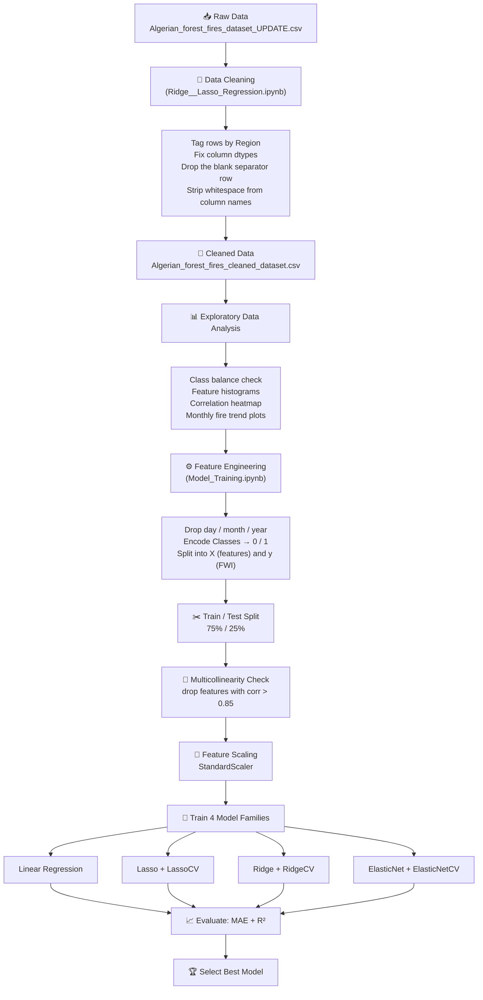
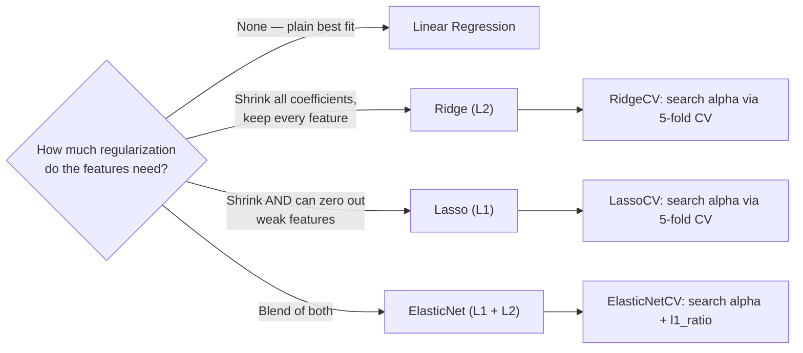

# 🔥 Algerian Forest Fires — FWI Regression Pipeline


A regression pipeline for predicting the **Fire Weather Index (FWI)** from the Algerian Forest Fires dataset, covering data cleaning, exploratory analysis, feature engineering, and a comparison of Linear, Ridge, Lasso, and ElasticNet regression models with cross-validated hyperparameter tuning.

---

## 📑 Table of Contents

1. [Project Overview](#1-project-overview)
2. [The Big Picture — End-to-End Pipeline](#2-the-big-picture--end-to-end-pipeline)
3. [Repository Structure](#3-repository-structure)
4. [Step-by-Step Walkthrough](#4-step-by-step-walkthrough)
5. [Model Comparison / Results](#5-model-comparison--results)
6. [Key ML Concepts Covered](#6-key-ml-concepts-covered)
7. [Limitations](#7-limitations)
8. [Tech Stack](#8-tech-stack)
9. [How to Run](#9-how-to-run)
10. [Author](#10-author)

---

## 1. Project Overview

**Dataset:** Algerian Forest Fires Dataset — 244 records from two regions of Algeria (Bejaia in the northeast, Sidi-Bel Abbes in the northwest), 122 records each, collected June–September 2012. Each record has 11 weather/fire-index attributes plus a `Classes` label (`fire` / `not fire`).

**Target variable:** `FWI` (Fire Weather Index) — a continuous score, so this is framed as a **regression problem**.

The dataset also includes a binary `Classes` column, which would support a classification formulation ("will there be a fire?"). This project instead predicts the continuous FWI score; a classification variant using `Classes` as the target is a natural extension.

**Two notebooks, two jobs:**

| Notebook | Role |
|---|---|
| `Ridge__Lasso_Regression.ipynb` | Loads the **raw** CSV, cleans it, explores it (EDA), and writes out a cleaned CSV |
| `Model_Training.ipynb` | Loads the **cleaned** CSV, engineers features, trains 4 regression models (+ 3 cross-validated variants), and evaluates them |

---

## 2. The Big Picture — End-to-End Pipeline

The diagram below summarizes the complete workflow, from raw data to final model selection.



---

## 3. Repository Structure

> Suggested layout — update paths to match the actual repository structure.

```
Algerian-Forest-Fire-FWI-Prediction/
│
├── Data/
│   ├── Algerian_forest_fires_dataset_UPDATE.csv      # raw dataset (input)
│   └── Algerian_forest_fires_cleaned_dataset.csv     # cleaned dataset (generated)
│
├── Notebooks/
│   ├── 01_Data_Cleaning_and_EDA.ipynb                # currently: Ridge__Lasso_Regression.ipynb
│   └── 02_Model_Training.ipynb                       # currently: Model_Training.ipynb
│
├── requirements.txt
└── README.md
```

---

## 4. Step-by-Step Walkthrough

### Step 1 — Load & Understand the Raw Data
The raw CSV has a two-row header — the actual column names start on row 2, so `header=1` is used when reading it. The file also contains two datasets concatenated together: the first 122 rows correspond to the Bejaia region, the remainder to Sidi-Bel Abbes, separated by a blank row.

```python
dataset = pd.read_csv('Algerian_forest_fires_dataset_UPDATE.csv', header=1)
```

### Step 2 — Data Cleaning
Performed in the following order:

1. **Tag the region** — rows `0:122` get `Region = 0` (Bejaia), rows `122:` get `Region = 1` (Sidi-Bel Abbes).
2. **Drop nulls** — the row that separated the two regions in the raw file becomes fully null once concatenated, and is dropped.
3. **Strip column names** — several column headers contained leading/trailing whitespace (e.g. `" RH"`, `"Classes  "`), which breaks exact-match column references. `df.columns = df.columns.str.strip()` resolves this for every column in one step.
4. **Fix dtypes** — `month`, `day`, `year`, `Temperature`, `RH`, `Ws` are cast to `int`; the remaining numeric columns are cast to `float` (`Classes` stays text at this stage).
5. **Save the cleaned dataset** so the second notebook does not repeat this work:

```python
df.to_csv('Algerian_forest_fires_cleaned_dataset.csv', index=False)
```

### Step 3 — Exploratory Data Analysis
Before model training, the following exploratory checks were performed:
- **Histograms** of every numeric feature, to review distributions and skew.
- **Class balance** — roughly 58% fire / 42% not-fire, so no severe imbalance.
- **Correlation heatmap** — an initial view of which features move together.
- **Monthly fire counts per region** — fires cluster heavily in **June–August**, peak in **August**, and drop off by **September**, in both regions. This seasonal pattern is relevant to any future time-aware modeling.

### Step 4 — Feature Engineering & Target Definition
```python
df.drop(['day', 'month', 'year'], axis=1, inplace=True)
df['Classes'] = np.where(df['Classes'].str.contains("not fire"), 0, 1)

X = df.drop('FWI', axis=1)   # everything except the target
y = df['FWI']                # the target: Fire Weather Index
```

Notes:

- `day`, `month`, and `year` are dropped after EDA. As raw integers, these would be misinterpreted by a linear model as ordinal magnitudes (e.g. month `12` is not "12x" of month `1`).
- Class labels are matched using `.str.contains("not fire")` rather than an exact string match. The raw `Classes` column contained inconsistent whitespace and formatting (e.g. `"fire "`, `"not fire  "`), which an exact comparison would have missed.

### Step 5 — Train / Test Split
```python
X_train, X_test, y_train, y_test = train_test_split(X, y, test_size=0.25, random_state=42)
# → 182 training rows, 61 test rows
```
`random_state=42` is fixed for reproducibility.

### Step 6 — Multicollinearity Check & Feature Selection
Several of the weather-index columns (`FFMC`, `DMC`, `DC`, `ISI`, `BUI`) are, by design, derived from overlapping fuel-moisture calculations and tend to be highly correlated with each other. Strongly correlated features inflate coefficient variance in a linear model and reduce interpretability. A helper function walks the correlation matrix and flags anything above a threshold:

```python
def correlation(dataset, threshold):
    col_corr = set()
    corr_matrix = dataset.corr()
    for i in range(len(corr_matrix.columns)):
        for j in range(i):
            if abs(corr_matrix.iloc[i, j]) > threshold:
                col_corr.add(corr_matrix.columns[i])
    return col_corr

corr_features = correlation(X_train, 0.85)   # threshold selected via domain judgment
```

With a **0.85** threshold, this drops **`DC`** and **`BUI`** — both correlate above 0.94 with `DMC`, which is expected since BUI is computed from DMC and DC in the standard FWI formula. Feature count goes from 11 → 9.

### Step 7 — Feature Scaling
```python
scaler = StandardScaler()
X_train_scaled = scaler.fit_transform(X_train)
X_test_scaled  = scaler.transform(X_test)
```
This step matters more here than in plain linear regression: Ridge, Lasso, and ElasticNet all penalize coefficient size, and that penalty is only meaningful if every feature is on the same scale. Without scaling, a feature measured in the hundreds (like `DC`) would be penalized very differently from one measured in single digits (like `Rain`), regardless of its actual importance. The scaler is fit on the training set only; `transform` (without `fit`) is applied to the test set to avoid leaking test-set statistics into training.

### Step 8 — Model Training
Four regression families are trained, each with a default configuration and (except plain Linear Regression) a cross-validated variant that searches for the best regularization strength automatically:



Every model follows the same fit → predict → score pattern, e.g.:

```python
ridge = Ridge()
ridge.fit(X_train_scaled, y_train)
y_pred = ridge.predict(X_test_scaled)
mae = mean_absolute_error(y_test, y_pred)
score = r2_score(y_test, y_pred)
```

### Step 9 — Evaluation & Model Selection
Every model is scored on the same two metrics on the held-out test set:
- **MAE (Mean Absolute Error)** — average error magnitude, in the same units as FWI. Lower is better.
- **R² Score** — proportion of variance in FWI explained by the model. Closer to 1.0 is better.

---

## 5. Model Comparison / Results

Results on the held-out test set (`random_state=42`):

| Model | MAE ↓ | R² ↑ | Notes |
|---|---|---|---|
| **Linear Regression** | **0.5468** | **0.9848** | Best result overall — no regularization needed here |
| Ridge (default α=1.0) | 0.5642 | 0.9843 | Near-identical to Linear |
| RidgeCV (5-fold) | 0.5642 | 0.9843 | Chose the same effective alpha as the default |
| ElasticNetCV (5-fold) | 0.6576 | 0.9814 | Tuning recovered most of the performance lost at default settings |
| LassoCV (5-fold) | 0.6200 | 0.9821 | Best α found ≈ 0.057 |
| Lasso (default α=1.0) | 1.1332 | 0.9492 | Default alpha over-penalizes; clearly under-tuned |
| ElasticNet (default) | 1.8822 | 0.8753 | Weakest model — default alpha/l1_ratio is a poor fit here |

Linear Regression achieved the best performance, with Ridge close behind. This suggests that once the highly collinear features (`DC`, `BUI`) were removed in Step 6, the remaining nine features did not carry enough multicollinearity or noise for regularization to add further benefit. The default Lasso and ElasticNet runs underperform primarily because their default `alpha=1.0` was not tuned for this dataset's scale — the cross-validated variants close most of that gap, which is the broader takeaway: compare a model's default and CV-tuned versions before concluding that a given regularization approach underperforms.

---

## 6. Key ML Concepts Covered

- Cleaning inconsistent categorical text data via substring matching
- Detecting and removing multicollinear features via a correlation threshold
- Why feature scaling is required before L1/L2-regularized models, but optional for plain linear regression
- Train/test split discipline (fitting the scaler on train only)
- Bias–variance tradeoff, illustrated with Linear vs Ridge vs Lasso vs ElasticNet on the same data
- Hyperparameter search via `*CV` estimators (`LassoCV`, `RidgeCV`, `ElasticNetCV`)
- Evaluating regression models with MAE and R² together, not just one metric

---

## 7. Limitations

- **Possible target leakage** — `Classes` (fire / not fire) is included as an input feature for predicting `FWI`. FWI is the standard basis for deriving fire-risk classification, so `Classes` is highly correlated with the target (0.78 correlation with FFMC, and by extension with FWI). Model performance should be re-evaluated with `Classes` excluded from the feature set to quantify its contribution to the reported R².
- **RidgeCV alpha grid** — the default scikit-learn grid (`[0.1, 1, 10]`) was used without modification. A wider grid (e.g. `np.logspace(-3, 3, 50)`) may yield a better-performing alpha.
- **Dependency version** — `ridgecv.get_params()` output includes a `normalize` parameter, which was removed in newer scikit-learn releases. The notebooks were originally run on an older version; running them in a current environment may raise minor API compatibility errors.
- **No residual analysis** — only predicted-vs-actual scatter plots are included. A residual-vs-fitted plot would give a clearer view of whether prediction errors are randomly distributed or biased at high/low FWI values.

---

## 8. Tech Stack

- **Python 3**
- **pandas**, **numpy** — data loading & manipulation
- **matplotlib**, **seaborn** — visualization
- **scikit-learn** — `train_test_split`, `StandardScaler`, `LinearRegression`, `Lasso`, `LassoCV`, `Ridge`, `RidgeCV`, `ElasticNet`, `ElasticNetCV`, `mean_absolute_error`, `r2_score`

---

## 9. How to Run

```bash
# 1. Clone the repo
git clone https://github.com/ashir1S/<repo-name>.git
cd <repo-name>

# 2. Install dependencies
pip install pandas numpy matplotlib seaborn scikit-learn jupyter

# 3. Run the notebooks in order
jupyter notebook Notebooks/01_Data_Cleaning_and_EDA.ipynb   # produces the cleaned CSV
jupyter notebook Notebooks/02_Model_Training.ipynb          # trains & evaluates models
```

---

## 10. Author

**Ashirwad Sinha**
GitHub: [@ashir1S](https://github.com/ashir1S)
